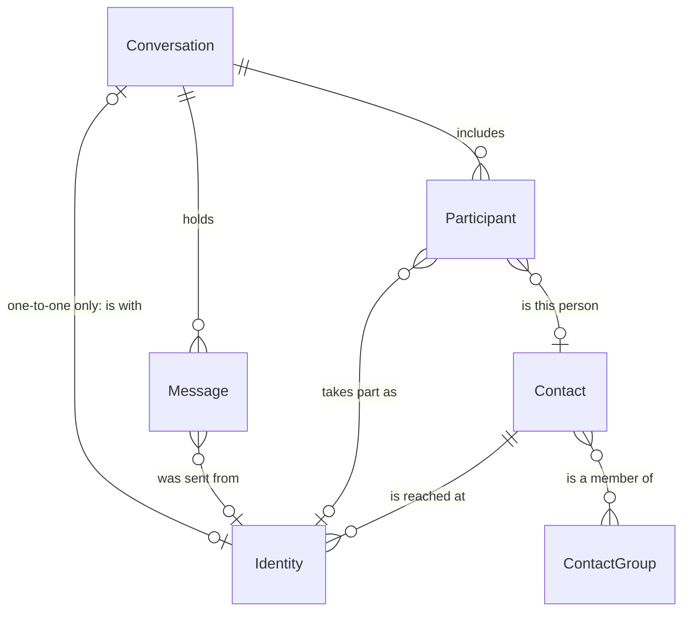
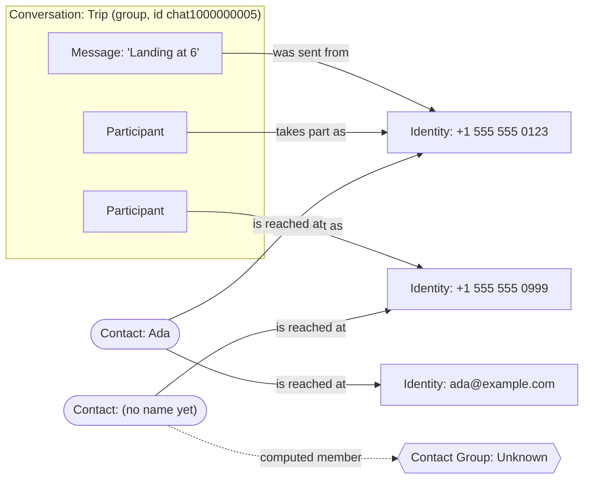

# Contacts, identities and messages

The people model: who the vault knows, how they are reached, and how
conversations and messages attach to them.

## Two words for one thing

An **identity** is one address a person is reached at: a phone number, an
email address, or a username on a service. The app and the published
documentation say identity. The code and the database say **handle**
(`handles`, `contact_handles`). They are the same thing. This document says
identity and gives the code name where it helps.

## The relationships

Each line reads left to right. A bar means exactly one, a circle means none is
allowed, and a crow's foot means many.

| Relationship | What it means |
|---|---|
| Contact is reached at Identity | A contact is one person and gathers any number of identities under one name. An identity belongs to at most one contact (`contact_handles`, keyed on the handle). |
| Conversation includes Participant | A participant is one person's seat in one conversation, and keeps what that backup called them there (`participants.name_alias`). |
| Participant takes part as Identity | Normally the address the person used. It is empty when the source named a person and recorded no address for them. |
| Participant is this person | Every participant has a contact (`participants.contact_id`). For a participant with no identity, this link is the only tie to a contact. |
| Conversation holds Message | A message lives in exactly one conversation. |
| Message was sent from Identity | Set for a received message. Empty for a message the account owner sent, and for one whose source recorded no sender (`messages.sender_handle_id`). A message never points at a contact; it reaches one through its sender's identity. |
| Conversation is with Identity | Only a one-to-one conversation is with an identity, and an identity has at most one such conversation. A group is with nobody; its people are its participants. |
| Contact is a member of Contact Group | Many to many. Unknown is a Contact Group the vault computes; nothing is added to it by hand. |

## Rules

**An import makes a contact for every person it meets.** An unmatched phone
number becomes a contact with that identity and no name. A person named with
no address becomes a contact with a name and no identity. Why: an identity on
no contact appears in no list in the product, so it could never be found,
named, or merged. Junk contacts cost one delete.

**A contact missing a name or an identity is Unknown.** Unknown is computed
from the contacts, so it empties as people are named. It uses the ordinary
contacts screen; there is no separate review queue. Unknown counts as a
group: the contact shows it among its Contact Groups, and an Unknown contact
is not in "No group". Why: a contact listed under Unknown whose own groups
read "No groups" says two things at once.

**A contact with no preferred name goes by its first identity, in italics.**
The vault sends the name empty rather than a placeholder such as `(unknown)`,
and sends `unknown` beside it, computed by the one rule above. The screen
shows the identity where the name would be. Why: a list of rows that all read
`(unknown)` cannot be told apart, and the italics keep an address from reading
as a name someone gave the contact.

**A group conversation is not a person.** A source gives a group an id of its
own, such as `chat1000000005`. The vault stores it as the conversation's chat
handle (`conversations.chat_handle_id`) so the same group is recognised on
the next import. It gets no contact and is nobody's identity. The same holds
for the `orphaned` conversation. Only a one-to-one conversation's chat handle
is a person's address, and only that one gets a contact. Why: the id reaches
nobody, and a contact made from it shows up in Contacts as a nameless person
who never existed.

**One number is one person on every service.** A phone number that arrives as
an iMessage address and again as an SMS address is two `handles` rows. When
one of them is on a contact, the other joins the same contact
(`contact_id_of_sibling_handle`). Why: the rows differ only by transport, and
splitting them would show one person twice.

**An import names only a nameless contact.** When the backup knows a name and
the contact has none, the import sets it and marks it as imported. A name a
person types or loads from an address book replaces an imported one. A later
backup with a different spelling does not. See
[ADR 0006](../adr/0006-an-import-names-the-contact.md).

**Reloading an address book updates its contacts in place.** A contact the
book created (`origin = 'address_book'`) is matched to a card in the new file
by phone number. A match keeps its row and its id: the name and the phone
numbers change to what the card says, and the Contact Groups the person put
it in, the conversations it takes part in, and the record of the import that
met it all stay attached. A card that matches nothing becomes a new contact.
A book contact that no card matches is deleted, memberships included, because
the person is out of the file. A card whose number changed between two loads
matches nothing, so it reads as one contact gone and one arrived. Why: three
things hang off `contacts.id` (`contact_group_members`, `participants`,
`vault_import_contacts`), and deleting the row and making a new one would
drop all three every time the book is refreshed. A card whose phone is on a
contact an import discovered or the person typed joins that contact instead
and never makes a book contact. An identity the book dropped stays in the
vault while a conversation, a message, or the account's own profile uses it;
a stale identity nothing uses goes with the link.

**A participant's display name has one rule.** The contact's name, else what
that backup called them in that conversation, else the identity. One loader
applies it for the conversation list, the message pane, and Export.

**Deleting a contact keeps its conversations.** The name and details go. The
identities stay in their conversations and the person becomes Unknown again.

**An account's own identity is a label, and its message counts describe
what it takes part in.** Linking an address to an account (`account_handles`)
says "this address is me"; it changes no message, and neither does removing
it. Whether a message reads as sent or received comes from the backup it was
imported from. What the product shows beside an account's identity, and
repeats before it is removed, is the number of messages in the direct and the
group conversations that identity takes part in, counted the way a contact's
identities are in the contact drawer. Why: one definition of "a message of an
identity" for both tables, and a count the person can check by opening the
conversations. Rejected: counting messages the identity sent. An account's
own messages are marked sent by the backup and carry no sender identity, so
that count would be zero for the identity that matters most.

**An import replaces a trashed contact.** When an import meets an identity of
a trashed contact, it discards that contact with every identity it had and
makes a new one from the backup, as a first import would. See
[ADR 0013](../adr/0013-an-import-replaces-a-trashed-contact.md).

## One group chat, drawn out

A group called Trip with two other people. Ada has a phone number and an
email address on one contact. The second person has no name yet, so the vault
counts them in Unknown. The group's id stays on the conversation and touches
nothing else.

## Where it lives in the code

| Concern | Location |
|---|---|
| Tables for contacts, identities, Contact Groups, trash | `schema/sql/contacts.sql` |
| Tables for conversations, participants, messages | `schema/sql/messages.sql` |
| What an import creates for a conversation and its participants | `crates/vault/server/src/import/staging.rs` |
| Making, naming, and replacing a contact during import | `crates/vault/server/src/import/contact_name.rs` |
| Linking identities to contacts, sibling identities | `crates/vault/server/src/db/contacts.rs` |
| The display name rule | `crates/vault/server/src/db/participant_names.rs` |
| Which conversations involve a contact | `involves_contact_expr` in `contacts_api.rs`, `conversation_involves` in `search/bridge.rs` |
