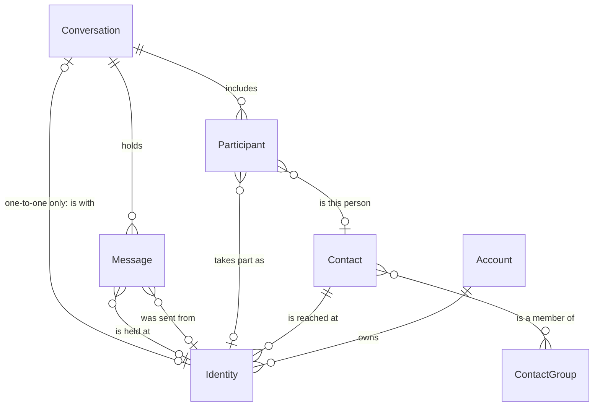

# Contacts, identities and messages

The people model: who the vault knows, how they are reached, and how
conversations and messages attach to them.

## Two words for one thing

An **identity** is one address a person is reached at: a phone number, an
email address, or a username on a service. The app and the published
documentation say identity. The code and the database say **handle**
(`handles`, `contact_handles`). They are the same thing. This document says
identity and gives the code name where it helps.

## The relationships

Each line reads left to right. A bar means exactly one, a circle means none is
allowed, and a crow's foot means many.

| Relationship | What it means |
|---|---|
| Account owns Identity | An account's identity is one of the account holder's own addresses: the messages from it belong to the holder (`account_handles`). This is ownership, where a contact's identity is participation; the rule below says how Import applies it. |
| Contact is reached at Identity | A contact is one person and gathers any number of identities under one name. An identity belongs to at most one contact (`contact_handles`, keyed on the handle). |
| Conversation includes Participant | A participant is one other person's seat in one conversation, and keeps what that backup called them there (`participants.name_alias`). The account holder is never a participant; the rule below says why. |
| Participant takes part as Identity | Normally the address the person used. It is empty when the source named a person and recorded no address for them. |
| Participant is this person | Every participant has a contact (`participants.contact_id`). For a participant with no identity, this link is the only tie to a contact. |
| Conversation holds Message | A message lives in exactly one conversation. |
| Message is held at Identity | The account holder's own address on this message: the one it was sent from, or the one it was received at (`messages.owner_handle_id`). Set from the backup, sent or received. Empty when the backup names no owner. The identity need not be one of the account's. |
| Message was sent from Identity | Set for a received message. Empty for a message the account owner sent, and for one whose source recorded no sender (`messages.sender_handle_id`). A message never points at a contact; it reaches one through its sender's identity. |
| Conversation is with Identity | Only a one-to-one conversation is with an identity, and an identity has at most one such conversation. A group is with nobody; its people are its participants. |
| Contact is a member of Contact Group | Many to many. Unknown is a Contact Group the vault computes; nothing is added to it by hand. |

## Rules

**An import makes a contact for every person it meets.** An unmatched phone
number becomes a contact with that identity and no name. A person named with
no address becomes a contact with a name and no identity. A message's sender
counts as met even when no conversation header names them, as in
`orphaned.jsonl` or a group header that leaves someone out. Why: an identity on
no contact appears in no list in the product, so it could never be found,
named, or merged. Junk contacts cost one delete.

**A contact missing a name or an identity is Unknown.** Unknown is computed
from the contacts, so it empties as people are named. It uses the ordinary
contacts screen; there is no separate review queue. Unknown counts as a
group: the contact shows it among its Contact Groups, and an Unknown contact
is not in "No group". Why: a contact listed under Unknown whose own groups
read "No groups" says two things at once.

**A contact with no preferred name goes by its first identity, in italics.**
The vault sends the name empty rather than a placeholder such as `(unknown)`,
and sends `unknown` beside it, computed by the one rule above. The screen
shows the identity where the name would be. Why: a list of rows that all read
`(unknown)` cannot be told apart, and the italics keep an address from reading
as a name someone gave the contact.

**A group conversation is not a person.** A source gives a group an id of its
own, such as `chat1000000005`. The vault stores it as the conversation's chat
handle (`conversations.chat_handle_id`) so the same group is recognised on
the next import. It gets no contact and is nobody's identity. The same holds
for the `orphaned` conversation. Only a one-to-one conversation's chat handle
is a person's address, and only that one gets a contact. Why: the id reaches
nobody, and a contact made from it shows up in Contacts as a nameless person
who never existed.

**One number is one person on every service.** A phone number that arrives as
an iMessage address and again as an SMS address is two `handles` rows. When
one of them is on a contact, the other joins the same contact
(`contact_id_of_sibling_handle`). Why: the rows differ only by transport, and
splitting them would show one person twice.

**A phone number has one key everywhere.** `phone::normalize_typed_handle`
gives a number its key, and the same key is used by the `handles` row, by the
entry the contacts book files it under, and by the owner's own numbers
(`OwnerHandleSet`). A number written with `+` keeps its country:
`+65 9123 4567` is `+6591234567`. A number without `+` is read as a US
number when it has ten digits, or eleven starting with `1`. Anything else keeps
its digits as written, so `020 7946 0000` is `02079460000` and never the
invented `+02079460000`. Why: a book or owner key that differs from the handle
key names nobody, or names the wrong person. Stripping the `+` first once filed
`+65 9123 4567` under the US number `+16591234567`.

**An import names only a nameless contact.** When the backup knows a name and
the contact has none, the import sets it and marks it as imported. A name a
person types or loads from an address book replaces an imported one. A later
backup with a different spelling does not. See
[ADR 0006](../adr/0006-an-import-names-the-contact.md).

**The address book is a file for editing contacts, not a source of them.**
Contacts and identities arrive with message imports; the address book is
how a person takes what the vault holds out to a spreadsheet, corrects it,
and puts it back. The file is the vault's own CSV, one row per identity:
`contact_id, display_name, groups, service, handle_type, identity`. Export
fills `contact_id` from `contacts.id`; on load, rows that share an id are one
contact, a blank id makes a new contact, and any other text groups new rows
under a key of the person's choosing. `display_name` and `groups` (Contact
Group names, separated by `;`) describe the contact, so they repeat on each
of its rows and must agree or be blank; two rows of one contact that disagree
refuse the load. `service` and `handle_type` take the values the `handles`
table stores. Why: an address book from a phone puts every number and email
on the card into the vault as a text-message identity whether or not a
message ever used it, cannot say which service an address belongs to, and
carries numbers formatted every way at once. A file the vault writes itself
has none of those problems, and a spreadsheet is the right tool for naming
fifty Unknowns at once. Rejected: reading vCard or a vendor's CSV directly.
A conversion from vCard to this file, for editing before a load, is
separate work.

**A load is Append or Edit, and touches only the contacts in the file.**
Append creates the contacts the file names, renames the ones it holds,
and adds the identities and Contact Group memberships it lists; it removes
nothing. Edit does the same and then makes each contact in the file hold
exactly the identities and memberships its rows list, so a row taken out of
the file takes that identity off the contact: the identity stays in its
conversations and the person is Unknown for it again, as after a contact
delete. A contact absent from the file is left alone in both modes, and no
mode deletes a contact, except one left with neither a name nor an identity,
which nothing could ever reach. A loaded name replaces one an import
supplied, as a typed name does, because the file is the person typing. A
group name that matches no Contact Group creates one. Why: the export can be
a subset (a search, the checked rows), so a file that spoke for the whole
vault would delete everyone it did not mention, and a file that could only
add would leave a wrongly linked address unfixable from the sheet.

**A load is strict, and refuses whole.** A phone is keyed by the one rule
above, an email is lowercased and must be one `@` with text on both sides,
and an unknown `service` or `handle_type` is an error. Any bad row refuses
the whole load, naming each row and its reason, and nothing is stored as
"needs a look". Why: the file is edited before it is loaded, so a refused row
is a fix made in the sheet in seconds, while a stored bad key is a contact
that matches no message and has to be found later. A partial load would leave
the person unsure which rows went in, and a load is cheap to repeat.

**An identity moves only from a contact the load may change.** When a row
puts an identity on one contact and the vault has it on another, it moves to
the file's contact if the current holder is nameless (an Unknown an import
made) or is itself in the file. Taking an identity from a named contact the
file does not mention refuses the load, naming the row, the identity and
both contacts. The same identity under two ids in one file refuses the load
too. Why: naming the Unknowns is the job the file exists for, so that move
must be free; a silent move off a named person is the one outcome the person
cannot see happen, and asking for both contacts in the file makes it
deliberate. Rejected: refusing whenever the holder has other identities. An
Unknown holder often has two handles for one number (iMessage and SMS), and
that rule would refuse the commonest cleanup.

**Export writes the current Contacts list; load lives under Settings.** The
export is on the Contacts screen and writes the rows the person is looking
at: the search words and the checked contacts pick what goes in the file, and
an empty search is everything, nameless contacts included. The load answers
how many contacts it created, updated and deleted, how many identities it
added, moved and removed, and how many groups it created. Why: the job is
nearly always "the Unknown ones", "this group" or "these ten", which the
Contacts screen already expresses and a Settings button cannot. A durable
record of each load, in the Settings table beside message imports, is
deferred, not rejected.

**A person has one seat in a conversation.** A participant with an
identity is keyed on the conversation and that identity. A participant with
no identity is keyed on the conversation and its contact. The schema holds
both as partial unique indexes on `participants`, and an import that meets
an existing seat leaves it as it is. `participants.contact_id` is not part of
the first key, because a participant with an identity finds its contact
through `contact_handles`, and the column goes empty when an import replaces
a trashed contact. Why: a key that includes an empty column matches nothing
on SQLite or Postgres, so re-importing the same backup added the same person
again.

**A participant's display name has one rule.** The contact's name, else what
that backup called them in that conversation, else the identity. One loader
applies it for the conversation list, the message pane, and Export.

**Deleting a contact keeps its conversations.** The name and details go. The
identities stay in their conversations and the person becomes Unknown again.

**The account holder is never a participant.** The vault is always read from
the account holder's side: every conversation in an account is the holder's
own, so the vault knows they are in it without listing them. Participants are
the other people. Which of the holder's identities a message used is recorded
on the message itself, as the identity it is held at, taken from the message
when the backup records it per message (iMessage) and from the backup's header
when the backup has one owner. See
[ADR 0015](../adr/0015-the-owner-is-recorded-on-the-message.md). Why: a
participant row for the holder would need a contact, a name, and a place in
every participant count and conversation title, and each reader would then have
to leave it out again.

**An account's own identity means ownership, and its message counts
describe the messages it holds.** A contact's identity says the person took
part; an account's identity (`account_handles`) says the messages sent from or
received at that address are the account holder's own. Import is where that
decision is made: the reader takes the holder's addresses from the backup when
the backup names its owner, and from this list when it does not, and marks each
message sent or received accordingly. Linking or removing an identity afterwards
changes no message already imported. What the product shows beside an account's
identity, and repeats before it is removed, is the number of messages held at
that identity, split by direct and group conversation, and the number of
conversations holding at least one of them. Why: the count says what the person
did at that address, and one conversation that used two of the holder's
identities counts each message once, under the identity it used. Rejected:
counting messages the identity sent, because received messages are the holder's
too; and counting every message in a conversation the identity appears in,
because a conversation that used two identities would count all its messages
twice.

**An import never adds an account identity.** A backup that names an owner
address the account does not have records it on the messages and leaves the
account's identities as they are. Why: the person adds identities themselves,
and an address they have not added is one they chose not to claim; a backup's
owner field can also name something that is not a messaging address, such as
the mail account a backup was stored in. Because the address is already on the
messages, linking it later shows its counts without a re-import.

**An import replaces a trashed contact.** When an import meets an identity of
a trashed contact, it discards that contact with every identity it had and
makes a new one from the backup, as a first import would. See
[ADR 0013](../adr/0013-an-import-replaces-a-trashed-contact.md).

**A failed import changes no contact.** Staging meets every identity first,
so it is where the import makes contacts and discards trashed ones. Staging
and promote run in one transaction, and a failure in either rolls both back.
Why: a trashed contact's name and Contact Groups are gone for good once
discarded, and a contact made for an import that brought no messages is
clutter the person never asked for.

## One group chat, drawn out

A group called Trip with two other people. Ada has a phone number and an
email address on one contact. The second person has no name yet, so the vault
counts them in Unknown. The group's id stays on the conversation and touches
nothing else.

## Where it lives in the code

| Concern | Location |
|---|---|
| Tables for contacts, identities, Contact Groups, trash | `schema/sql/contacts.sql` |
| Tables for conversations, participants, messages | `schema/sql/messages.sql` |
| What an import creates for a conversation and its participants | `crates/vault/server/src/imports_api/staging.rs` |
| Making, naming, and replacing a contact during import | `crates/vault/server/src/imports_api/contact_name.rs` |
| Linking identities to contacts, sibling identities | `crates/vault/server/src/db/contacts.rs` |
| The display name rule | `crates/vault/server/src/db/participant_names.rs` |
| Which conversations involve a contact | `involves_contact_expr` in `db/contacts/read.rs`, `conversation_involves` in `search/bridge.rs` |
