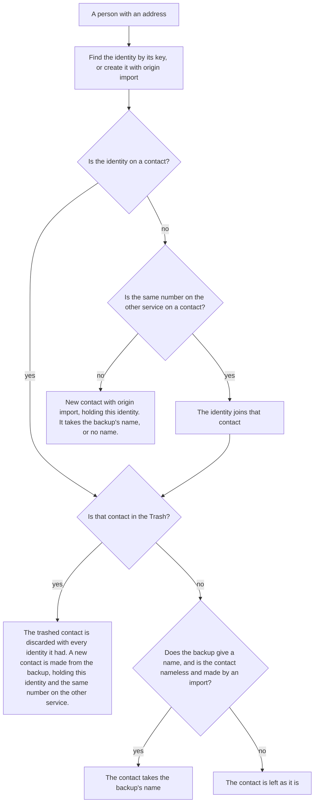
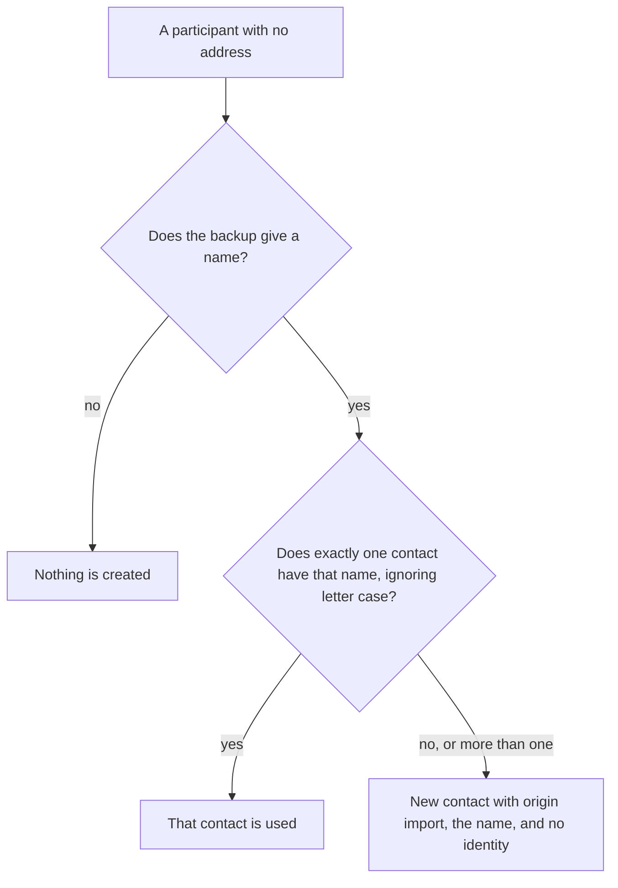
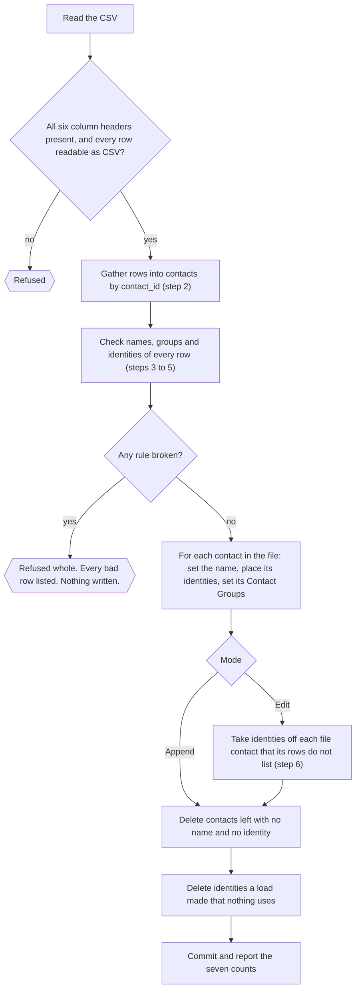
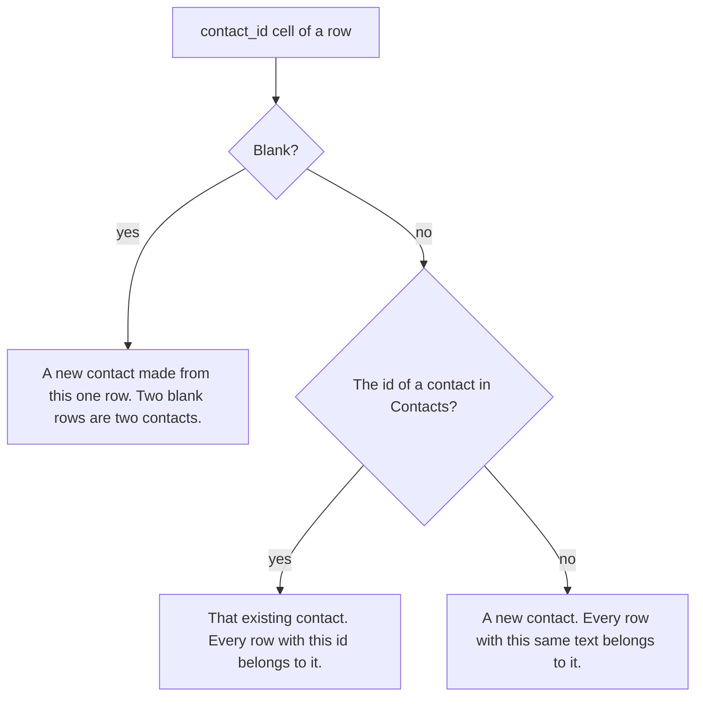
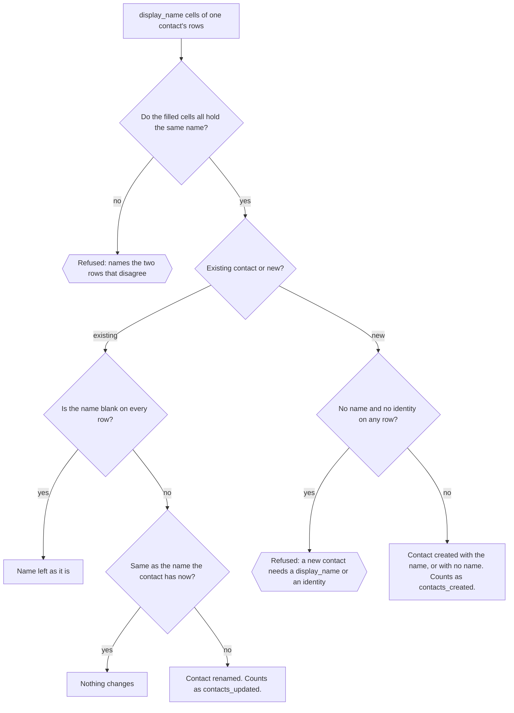
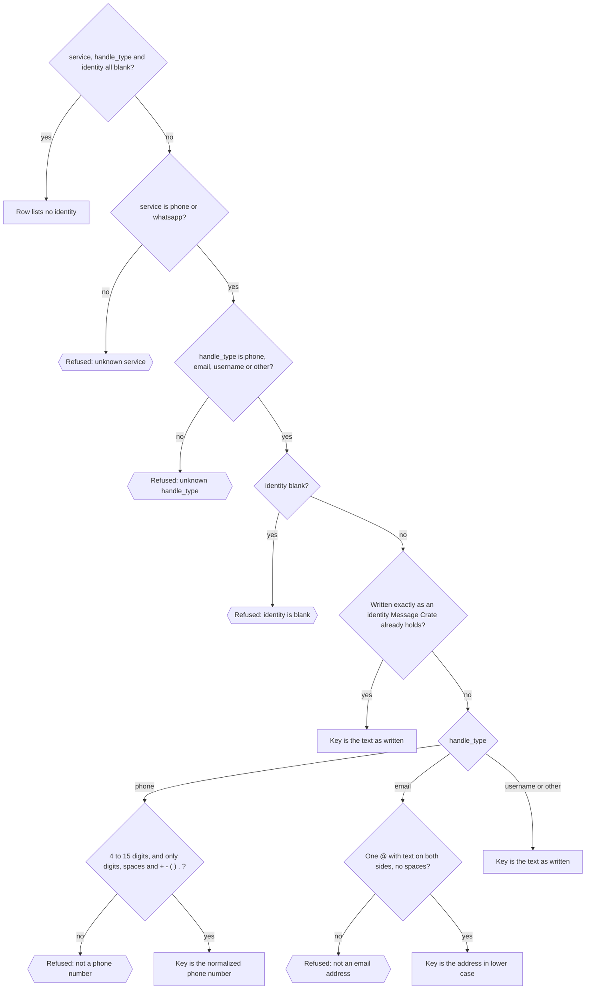
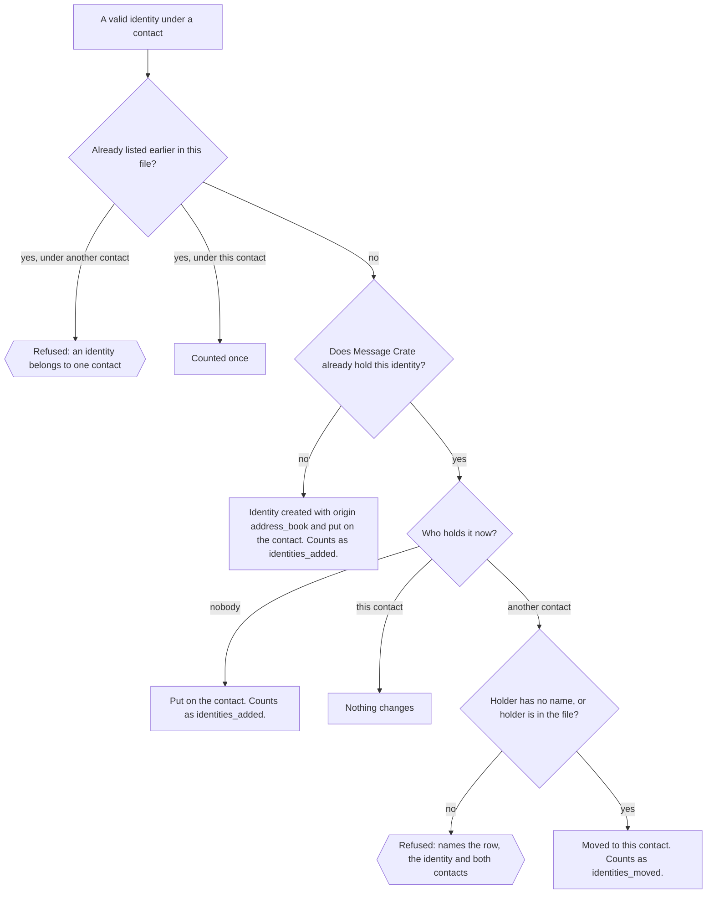
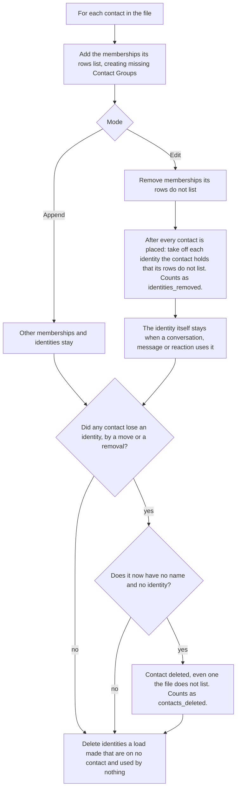

# How contacts are made and changed

Two things write contacts and identities in bulk: an import of a backup, and
an address book load. They write to the same tables under different rules.
This document follows each one step by step and then sets them side by side.

The words and the relationships are in
[Contacts, identities and messages](contacts-identities-and-messages.md),
which also holds the reason for each rule. This document is the data flow.

The intended order is import first, then the address book. An import brings
the people in, many of them with no name. The person exports the address
book, names the Unknowns in a spreadsheet, and loads the file back.

In every diagram a six-sided box is a refusal.

## An import of a backup

The code is `crates/server/server/src/imports_api/contact_name.rs`. The rules
are the same for every source: an iPhone backup, an Android SMS backup, or
WhatsApp.

An import only adds. It never moves an identity from one contact to another,
never removes an identity or a Contact Group membership, and never deletes a
contact outside the Trash.

### A person the backup gives an address for

An import meets a person three ways: as a participant of a conversation, as
the other side of a one-to-one conversation, or as the sender of a message.
A sender counts even when no conversation names them. The account holder is
never one of these people.

- A phone number has one key. A number with `+` keeps its country. A number
  without `+` is read as a US number when it has ten digits, or eleven
  starting with `1`.
- iMessage, SMS, MMS and RCS are all text messages, so one number is one
  identity with the service `phone`. The same number on WhatsApp is a second
  identity with the service `whatsapp`.
- An import names a contact only when the contact has no name and an import
  made it. A name a person typed, or a name a load set, survives every later
  import.
- A phone number the import cannot key with confidence is stored and flagged
  for review. It does not stop the import.

### A person the backup names with no address

### What gets no contact

A group conversation's own id, such as `chat1000000005`, is stored on the
conversation so the group is recognised next time. It is nobody's identity
and gets no contact. The same holds for the `orphaned` conversation.

### When the run finishes

The Import Run makes one Contact Group named `<source> import <date>`. It
holds every contact the run created, named, gave an identity, or replaced
from the Trash. The membership is a snapshot and does not change later.

## An address book load

The code is `plan` and `apply` in
`crates/server/server/src/db/address_book.rs`.

The file has one row per identity and six columns: `contact_id`,
`display_name`, `groups`, `service`, `handle_type`, `identity`. A load runs
in Append mode, the default, or in Edit mode.

### 1. The whole load

Every row is checked before anything is written. Every broken rule is
collected, so one refusal names every bad row. The writes are one
transaction. A row with every cell blank is skipped.

### 2. Which contact a row speaks for

A `contact_id` is known only when it is a whole number and is the id of a
contact in Contacts. The id of a contact in the Trash is not known. It is
treated like any other text and makes a new contact.

### 3. The name

The rows of one contact must give the same `display_name` or leave it blank.
A loaded name replaces the name of an existing contact whenever it differs,
whatever set the old name: an import, an earlier load, or a person typing.
A rename by a load does not change the contact's `origin`. A contact a load
creates has the origin `address_book`.

### 4. Each identity: is the row valid?

A row that leaves `service`, `handle_type` and `identity` all blank lists no
identity. That is how a contact with no identity is written.

An identity written exactly as Message Crate already keys it is accepted as
it stands, so an exported file always loads back.

### 5. Each identity: who gets it?

An identity belongs to one contact. It moves to the file's contact freely
when its current holder has no name, or when the holder is also in the file.
Taking an identity from a named contact the file does not mention refuses
the load.

A move takes only the identity the row lists. The same number on the other
service stays where it is unless the file lists it too.

### 6. Contact Groups, and what Edit removes

The rows of one contact must list the same Contact Groups, in any order and
any letter case, or leave the cell blank. Names are separated by `;`. A name
Message Crate would not let a person create refuses the load. A name that
matches no Contact Group, ignoring letter case, creates one.

Append only adds. Edit makes each contact in the file hold exactly the
identities and memberships its rows list. In Edit, a contact whose `groups`
cell is blank on every row loses all its memberships.

### What a load leaves alone

- A contact the file does not list, in both modes. The one exception is a
  nameless contact that gives up an identity to a file contact. It is
  deleted if that leaves it empty.
- Identities and memberships of a file contact that its rows do not list, in
  Append mode.
- Contacts in the Trash. The file cannot speak for one. A nameless one can
  still give up an identity.

### The seven counts

| Count | What it counts |
|---|---|
| `contacts_created` | Contacts the load created |
| `contacts_updated` | Contacts in the file that were renamed, or whose identities or memberships changed |
| `contacts_deleted` | Contacts left with neither a name nor an identity |
| `identities_added` | Identities put on a contact that no contact held before |
| `identities_moved` | Identities taken from one contact and given to another |
| `identities_removed` | Identities taken off a contact. Edit only |
| `groups_created` | Contact Groups the load created |

## The two side by side

| | Import of a backup | Address book load |
|---|---|---|
| What starts it | Each person the backup's messages meet: a participant, the other side of a one-to-one conversation, or a sender | Each row of the CSV |
| New contact | One for every address no contact holds, named if the backup gives a name, otherwise nameless | One for a blank or unrecognised `contact_id`. It needs a name or an identity |
| Naming an existing contact | Only when the contact has no name and an import made it | Whenever the file's name differs, whatever set the old one |
| Same number on the other service | Joins the contact that already holds the other one | Does not follow. The file must list it |
| Identity already on another contact | Never moved. The import uses that contact | Moved if the holder is nameless or in the file. Otherwise the load is refused |
| Removing things | Never removes an identity, a membership, or a contact outside the Trash | Edit removes unlisted identities and memberships. An emptied nameless contact is deleted |
| Contact in the Trash | Discarded with all its identities and made new from the backup | Cannot be addressed. Its id is treated as unknown text |
| Person named with no address | Uses the contact with that name when exactly one has it, else makes a contact with a name and no identity | A row with a name and blank identity columns makes the same kind of contact, and never matches by name |
| Contact Groups | One group per Import Run, holding the contacts the run touched | The groups the `groups` column lists |
| Bad data | No refusal for contact reasons. An odd phone number is stored and flagged | Any broken rule refuses the whole file |
| `origin` written | `import` | `address_book` |

## What follows from the differences

- **A typed or loaded name survives every later import.** An import cannot
  rename a contact that has a name.
- **A load can rename anything.** It replaces a typed name as readily as an
  imported one.
- **Edit treats a blank `groups` cell as "no groups".** It does not mean
  "leave the memberships alone".
- **A contact the file does not list can still be deleted.** A nameless
  contact that gives up its last identity to a file contact is removed.

## Open questions

These are what the code does today. None has been decided as a rule, and
each has an open issue.

- **Should a load replace a name a person typed?** (#1057) It does. Before the
  address book became Message Crate's own CSV, a load replaced only an
  imported name.
- **Should an import name a nameless contact a load made?** (#1058) It does
  not. The
  import's rule needs the contact to be both nameless and of origin
  `import`.
- **Should a load be able to split one number across two contacts?** (#1059)
  It can.
  An import puts a number's text-message identity and its WhatsApp identity
  on one contact. A load that lists only one of them moves that one and
  leaves the other behind, which the rule "one number is one person on every
  service" says should not happen.
