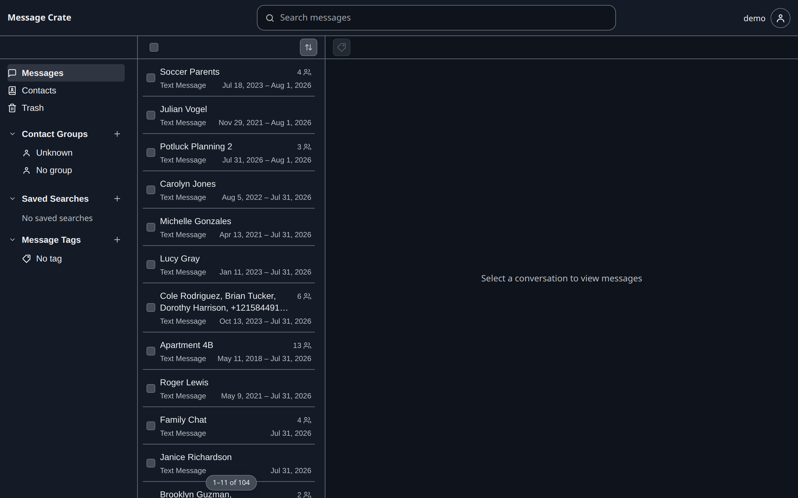
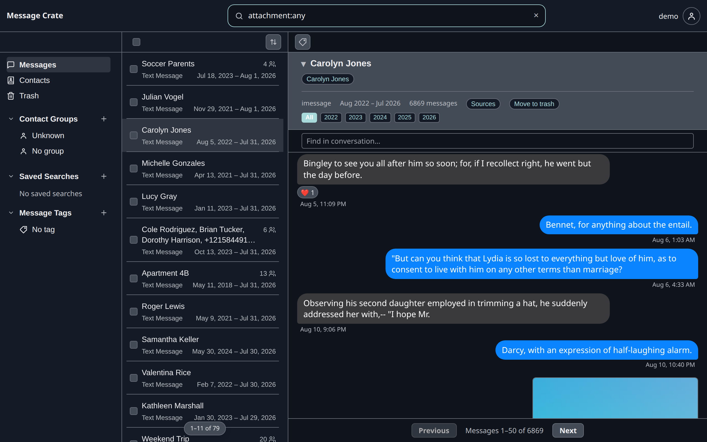

This step uses a browser only.
The desktop app comes later, in [step 5](/docs/user/get-started/install-the-desktop-app/), because looking at messages doesn't need it.

## Open the Demo Account

1. Open [http://localhost:8080](http://localhost:8080).
2. Select **Explore Demo Account**.

The Demo Account has no password, so there is nothing to type.
The card also shows **Create Owner**, which is for [step 4](/docs/user/get-started/start-your-own-message-crate/).

## Things to try



**Open a conversation.**
**Messages** in the left panel shows every conversation.
Selecting one opens its messages on the right.
The year buttons above the messages jump to that year, and **Find in conversation** searches inside the one conversation.

**Search.**
The search box at the top takes plain words, and words with a meaning of their own.
`attachment:any` narrows the list to conversations that hold a photo, video, or file.
`name:Carolyn` narrows it to conversations with someone of that name.
[Search](/docs/user/features/messages/search/) lists every search word.



**Open Contacts.**
A contact gathers one person's phone numbers and email addresses, so their conversations from different apps appear together.

The demo text is sampled from *Pride and Prejudice*, which is why the conversations read oddly.

## What the Demo Account cannot do

The Demo Account may export, and move things to the Trash and restore them.
It may not import or delete for good.
Anyone who reaches this Message Crate can enter it, so those limits keep a person's own messages out of the demo data and keep one visitor from emptying it for the next.
The round button at the top right opens the account menu, which holds **Log out**.

## Delete the demo Message Crate

```bash title="Remove the demo container and its data"
docker rm -f message-crate-demo
docker volume rm message-crate-demo-data
```

The first command stops and removes the server.
The second deletes the demo database.
[http://localhost:8080](http://localhost:8080) no longer answers once both have run.

Next: [Start a Message Crate for real messages](/docs/user/get-started/start-your-own-message-crate/).
