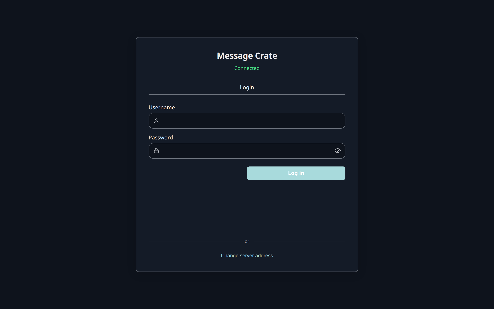

This step starts a Message Crate on this computer, filled with demo data.
Demo data is made-up conversations, contacts, and attachments.
It shows what the product does before any phone backup exists.

This Message Crate is for looking only.
[Step 3](/docs/user/get-started/look-around-the-demo-data/) ends by deleting it, and real messages go on a separate one in [step 4](/docs/user/get-started/start-your-own-message-crate/).

## Install Docker

The server is published as a Docker image and in no other form, so Docker is required.

- **Windows and macOS:** [Docker Desktop](https://docs.docker.com/desktop/). Docker Desktop must be running before the command below works.
- **Linux:** [Docker Engine](https://docs.docker.com/engine/install/).

`docker --version` in a terminal prints a version number once Docker is installed.

## Start the server

```bash title="Start a Message Crate with demo data"
docker run -d --name message-crate-demo \
  -p 127.0.0.1:8080:8080 \
  -e DEMO_DATA=true \
  -v message-crate-demo-data:/app/data \
  bitrealm/message-crate:latest
```

On Windows, PowerShell needs the command on one line, without the trailing `\` characters.

What each part does:

| Part | Meaning |
|---|---|
| `--name message-crate-demo` | Names the container, so step 3 can delete it by name. |
| `-p 127.0.0.1:8080:8080` | Makes the server reachable at port 8080 from this computer only. |
| `-e DEMO_DATA=true` | Fills a new Message Crate with demo data on its first start. |
| `-v message-crate-demo-data:/app/data` | Keeps the database in a Docker volume named `message-crate-demo-data`. |

## Wait for the demo data

The first start writes the demo data before the server answers, which takes about a minute.
`docker logs -f message-crate-demo` shows the progress.
The server is ready when the log prints `Starting message-crate-server`.
`Ctrl+C` stops following the log and leaves the server running.

## Check that it worked

[http://localhost:8080](http://localhost:8080) in a browser shows a card titled **Message Crate**, with the word **Connected**, a **Username** field, a **Password** field, and a **Log in** button.



Is port 8080 already in use?

Docker then reports `port is already allocated` and the container doesn't start.
`docker rm message-crate-demo` removes the failed container.
Changing the first `8080` in the command to a free port, such as `-p 127.0.0.1:8090:8080`, moves the server to `http://localhost:8090`.

Next: [Look around the demo data](/docs/user/get-started/look-around-the-demo-data/).
