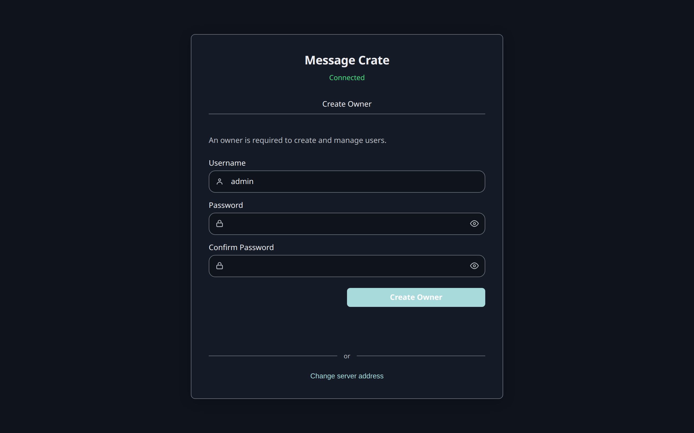
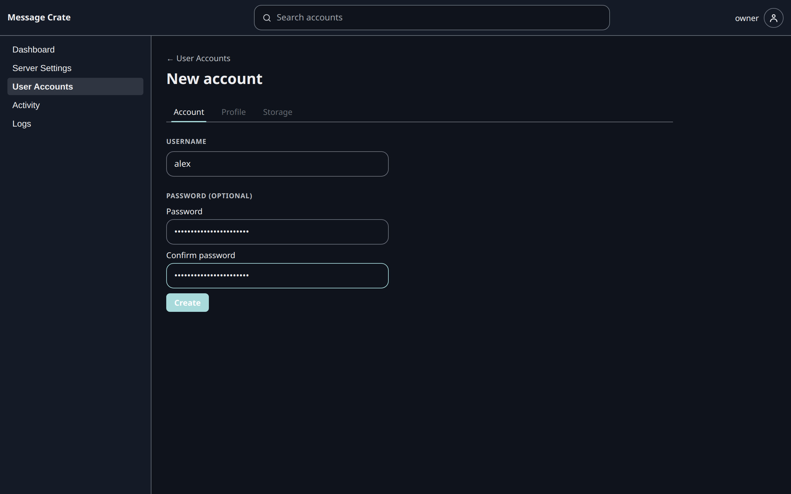
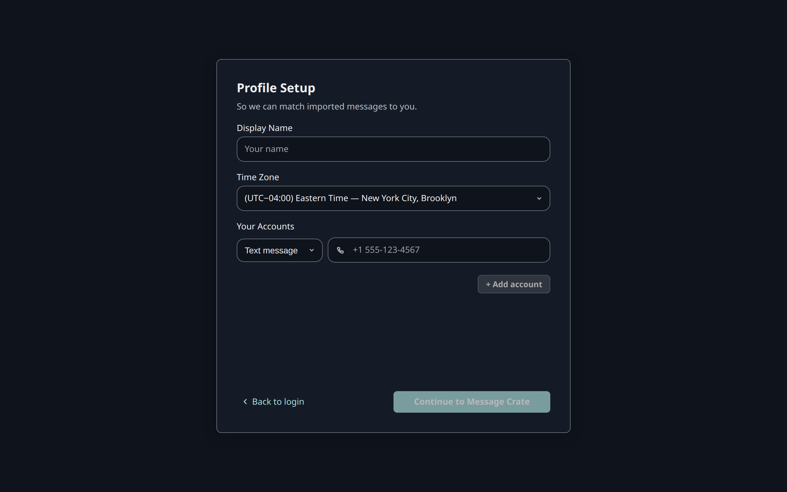

This step makes the Message Crate the desktop app started ready for real messages, and ends logged in as the account that will hold them.

It creates two logins, and both are needed:

- **The Owner** runs the Message Crate. It adds accounts and changes server settings. It holds no messages and can't import any.
- **An account** holds one person's messages and contacts. Import, search, and export all happen in an account.

The split means the person who runs the server can't read another person's messages through it.
The person who runs a Message Crate for themselves still needs both.

Real messages never go into the Demo Account. It can't import, so that no backup lands among the made-up conversations.

## Create the Owner

1. Open the desktop app. A Message Crate with no Owner shows **Create Owner**. Whoever fills it in first becomes the Owner.
2. Enter a **Username** and a **Password**, and repeat the password in **Confirm Password**.
3. Select **Create Owner**.

The app opens **Owner Home** on **User Accounts**, which lists the Owner and **demo**, the Demo Account.
The first screen now shows **Login** in place of **Create Owner**, and keeps **Explore Demo Account**.

The Owner's password is the only thing between the network and every account on this Message Crate, so it must be one that isn't used anywhere else.

## Add an account

1. On **User Accounts**, select **Add account**.
2. Enter a **Username**.
3. Enter a **Password** and repeat it in **Confirm password**. The form allows an account with no password. An account that holds real messages should have one.
4. Select **Create**.

The screen changes to **User Settings** for the new account.
Under **Message Permissions**, **Import**, **Export**, and **Delete** are all on, which is what importing needs.

Why not create the account from the login screen?

The login screen offers **Create Account** only when the Owner has turned that on under **Server Settings**.
It is off on a new Message Crate, so a stranger who reaches the server can't make themselves an account.

## Log in as the account

1. Open the account menu, the round button at the top right, and select **Log out**.
2. Log in with the new account's username and password.

The first login opens **Profile Setup**:

- **Display Name** is the name shown on messages this person sent.
- **Time Zone** is the zone every message time is shown in.
- **Your Accounts** takes this person's own phone numbers and email addresses. Import uses them to tell sent messages from received ones, so the phone number of the phone being imported belongs here. More can be added later in **Settings**.

Each row under **Your Accounts** has a type, **Text message**, **Email**, or **WhatsApp**, and a value.
**Continue to Message Crate** opens the conversation list, which is empty.

## Check that it worked

The app shows **No conversations**, logged in as the new account.
The left panel has **Import** and **Export**, which a browser doesn't show.

Next: back up the phone. [iPhone](/docs/user/your-messages/back-up-an-iphone/) or [Android](/docs/user/your-messages/back-up-an-android-phone/).
