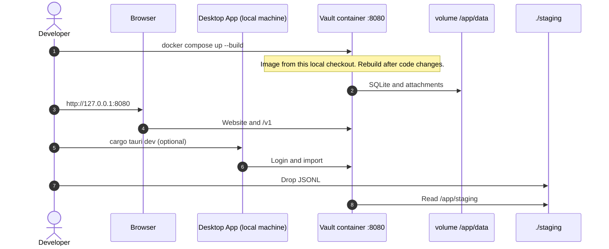

This page is for people who compile the Message Vault. It explains how to build a Docker image from a local checkout, what that image contains, and how that build compares to the image CI pushes to Docker Hub.

Everyday coding should just run on the local developer machine. Those steps are on [Contributing → Build and run](/vault/developer/contributing/#build-and-run).

People who only want a running vault, and who are not changing the code, should pull the published image. See [Try the vault](/vault/user/get-started/try-the-vault/#start-the-vault).

Build a local image when the work is about the container itself. Examples:

- A change to `docker/Dockerfile`, `.dockerignore`, or the `demo-seed` crate
- Checking that the website still works when it is compiled into the image, with no Vite server
- Reproducing a Docker Hub build failure before pushing a `v*` tag

:::note
A merge to `main` does not publish an image. CI only builds and pushes `bitrealm/message-vault` when a git tag that starts with `v` is pushed. How versions and tags work is on [Release](/vault/developer/release/).
:::

## Two Compose files

Docker Compose reads a YAML file and starts a container from it. This repository has two of those files. They both listen on port **8080**. They do not do the same thing.

`docker/compose.yml` names an image that already exists: `bitrealm/message-vault:latest`. Compose downloads that image from Docker Hub. It does not compile this local checkout. That file is the sample for [Try the vault](/vault/user/get-started/try-the-vault/#start-the-vault). Do not use that file from a local checkout if the goal is to test local code.

`docker/compose.release.yml` builds `docker/Dockerfile` from the files in this local checkout. The result is the same kind of image CI uploads to Docker Hub: a compiled vault binary, the website copied into `static/`, ffmpeg, and the sample-inbox files `demo-seed` writes during the build. After a code change, rebuild. The running container does not pick up edits on the local machine on its own.

A local checkout’s `.env.example` sets `COMPOSE_FILE=docker/compose.release.yml`. After copying that file to `.env`, `docker compose up --build` from the repository root uses the build-from-checkout file. Pass `-f` to override.

Do not run either Compose file at the same time as `./scripts/run-vault-dev.sh` or `./scripts/run-vault-pg-dev.sh`. Those scripts also bind port 8080. The Postgres script stops the `docker-compose.pg.yml` container when it exits.

## What the image contains

The container is the vault process only. The desktop app stays on the local machine and talks to the vault over HTTP.

| Piece | Role |
|---|---|
| `message-vault-server` | HTTP API under `/v1/*` and the website on port **8080** |
| SQLite | Database and attachments under `/app/data` |
| ffmpeg | Converts media so the browser can play it |
| Sample inbox files | Used on first start when `DEMO_DATA` is true and the data volume is empty |

The website in the image is the production Vite build from `web/`. There is no Vite dev server inside the container.

## How `docker/Dockerfile` builds

The file has three stages. Each stage is a temporary image. Only the last stage is what you run.

1. **Website.** Node 22 installs `web/` dependencies and runs `npm run build`. The output is `web/dist`.
2. **Vault binary.** Rust 1.95 compiles `message-vault-server` in release mode. Then it runs `demo-seed`. That program writes conversation JSONL and config under `crates/vault/demo-seed/`. Those files are not in git. The image must create them so a new volume can load the sample inbox.
3. **Runtime.** A slim Node 20 image gets ffmpeg, the server binary, the `demo-seed` output, `config/config.docker.toml`, and the website files copied to `static/`.

The build context is the **repository root**. `.dockerignore` decides what Docker sends into that context. It must ignore the live vault folder at the repo root (`/data`) so a personal database is not copied into the image. It must not ignore `crates/vault/demo-seed/data/`. That folder holds the Pride and Prejudice text and the name lists `demo-seed` reads.

`demo-seed` first writes into a temporary directory, then moves `staging/`, `config/`, and `README.md` into place. Docker overlay layers can put those paths on different mounts. A plain `rename` then fails with `Invalid cross-device link`. The crate copies the files and deletes the source when that happens.

## Build from this local checkout

Work from the repository root. Docker Desktop or Docker Engine with Compose v2 is required.

### Before you start

Copy [`.env.example`](https://github.com/bitrealm-io/message-vault/blob/main/.env.example) to `.env` if Compose should read `UID`, `GID`, and `COMPOSE_FILE` from the repository root.

`UID` and `GID` are the numeric user and group on this machine. Setting them to `id -u` and `id -g` keeps files the container writes owned by the account that started Compose.

### Build and start

This is the usual local path. Compose compiles `docker/Dockerfile` and starts the container.

```bash title="Build and start from this local checkout"
docker compose -f docker/compose.release.yml up --build
```

The vault is at **http://127.0.0.1:8080**. On an empty data volume, `DEMO_DATA=true` (the default) loads the sample inbox and claims the vault for a sample owner. Sign in as `demo` with an empty password, or as `admin` with the password `admin` to manage accounts.

With `DEMO_DATA=false` nothing is seeded and the vault starts unclaimed, so the first screen is **Create Vault Owner** rather than a login.

### Build without starting

Use this when the image should be compiled but not run yet.

```bash title="Build only, do not start"
docker compose -f docker/compose.release.yml build
```

### Match the CI build

CI builds `docker/Dockerfile` from the repository root. It does not use Compose. The shortest local equivalent is:

```bash title="Build with docker build"
docker build -f docker/Dockerfile -t bitrealm/message-vault:local .
```

CI uses Buildx and then pushes to Docker Hub. Locally, omit the push. To include the same optional build arguments CI passes:

```bash title="Build with Buildx, load onto this machine"
docker buildx build \
  -f docker/Dockerfile \
  -t bitrealm/message-vault:local \
  --build-arg BUILD_ID=local \
  --build-arg BUILD_DATE=$(date -u +%Y-%m-%d) \
  --load \
  .
```

`--load` stores the image on this machine. CI uses push instead.

### Start with no sample inbox

```bash title="Build and start with no sample inbox"
DEMO_DATA=false docker compose -f docker/compose.release.yml up --build
```

### Rebuild without cache

Use this after a failed build that used an old `.dockerignore`. Docker may otherwise reuse a layer that omitted `demo-seed` data files.

```bash title="Rebuild without cache"
docker compose -f docker/compose.release.yml build --no-cache
```

### After the container is running

Browse and search work in the browser against the container. The desktop app is optional. Importing a phone backup still needs the desktop app on the local machine.



## What CI builds

On a `v*` tag, the **Docker image** job in `.github/workflows/ci.yml` runs after the Rust tests pass. It builds `docker/Dockerfile` with context `.` (the repository root) and pushes:

- `bitrealm/message-vault:<version>` — for example `0.9.0`, with no `v`
- `bitrealm/message-vault:<major>.<minor>` — for example `0.8`
- `bitrealm/message-vault:latest`
- `bitrealm/message-vault:sha-<commit>`

That job is the Hub image. `docker/compose.release.yml` is the way to compile the same Dockerfile on a local machine. Pulling `bitrealm/message-vault:latest` is not a test of uncommitted Dockerfile changes.

## Run the published image

Pull and start `bitrealm/message-vault` from Docker Hub as described in [Try the vault](/vault/user/get-started/try-the-vault/#start-the-vault). That page covers `docker run` and `docker/compose.yml`. Upgrades that keep the existing database volume are on [Update](/vault/user/how-to/update/).

## Related

- [Contributing](/vault/developer/contributing/#build-and-run)
- [Release](/vault/developer/release/)
- [Try the vault](/vault/user/get-started/try-the-vault/)
- [Update](/vault/user/how-to/update/)
- [HTTP API](/vault/developer/reference/api/)
- [Config and accounts](/vault/developer/reference/config-and-accounts/)
