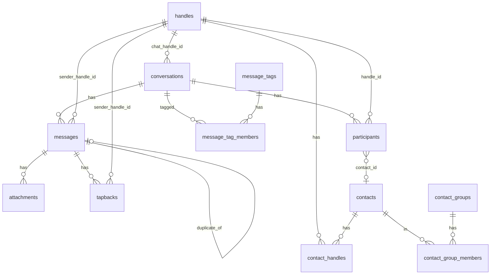
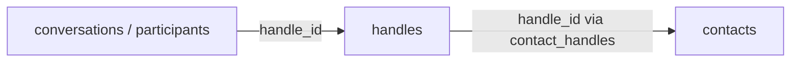

The Message Vault SQLite database falls into four groups:

1. **Chats and texts** — threads, participants, messages, files, reactions
2. **People and groups** — handles, address book, contact groups, accounts
3. **Staging** — temporary copies used while importing
4. **Trash markers** — soft-delete lists without removing chat data

Chats and people are **not** joined by a shared person ID. They meet through
the **`handles`** table: every phone number, email, or username appears once
per account **per platform** (`phone` or `whatsapp`) as a typed handle, and
conversations, participants, messages, and contacts all point at the same
handle rows.

## Chats and texts

### `conversations`

One row = one chat thread (`account_id`, `chat_handle_id` → `handles`,
`conversation_type`, `group_title`, and related fields). There is no
conversation-level messaging transport: SMS vs iMessage vs RCS varies per
message. Thread chrome for “which backup” uses distinct `messages.source`
values.

### `participants`

One row = one handle in one chat (`handle_id` → `handles`, optional
`contact_id` → `contacts`, optional `name_alias`).

### `messages`

One row = one message (`source`, `guid`, timestamps, `is_from_me`, optional
`service` for per-message transport such as `sms` / `imessage` / `rcs` /
`whatsapp`, `body`, `content_key`, optional `sender_handle_id` → `handles`,
optional `duplicate_of`).

### `attachments` / `tapbacks`

Files and reactions tied to a message. Attachments may store `sha256` and
derived (converted) paths for the browser. Reactions record `sender_handle_id`
→ `handles`.

## People and accounts

### `accounts` / `account_emails` / `account_handles` / `account_session_tokens` / `account_api_tokens`

Web accounts log in with **user ID** (`username`) and optional password.
`preferred_name` is the display name. `account_handles` (and optional
`account_emails`) are handles used to recognize “you” in messages — emails are
never used for login. GUI **session** tokens live in `account_session_tokens` (one
per account; rotated on login; prefix `mv-user-`). Named **API tokens** for CLI
import/export live in `account_api_tokens` (many per account; prefix `mv-api-`).

### `handles`

One row = one **platform** identity per account: `raw` (as the source wrote
it), `normalized`, `handle_type` (`phone` / `email` / `username` / `other`),
required `service` (`phone` | `whatsapp` — UI labels “Text message” /
“WhatsApp”), and an optional `normalized_note`. Handles are deduplicated per
account by `(account_id, normalized, handle_type, service)`, so the same phone
number on Text message and WhatsApp is two rows. SMS / iMessage / RCS are
**not** handle platforms; those are per-message transport values on
`messages.service`. Everywhere else in the schema, identities are referenced by
`handle_id` — never by text.

`normalized_note` is the needs-review flag: phone numbers are written as
E.164 only when unambiguous. Ambiguous values (e.g. a trunk-zero national
number like `020 7946 0000` without a country code) keep their digits as
`normalized` — never a fabricated `+0…` — and carry a human-readable reason
in `normalized_note` so the vault UI can surface them for review.

### `contacts` / `contact_handles`

Address book rows; display name is `preferred_name` only. `last_modified` is a
SQLite `datetime('now')` string bumped when the contact’s address-book shape
changes (create, rename, handle add/update/remove, group membership, merge
survivor, import sibling platform link) — not when messages arrive.
`contact_handles` links a contact to its `handles` rows per account (one contact
per handle per account).

### `contact_groups` / `contact_group_members`

Named groups and membership. Groups are ordinary memberships with no reserved
status names.

### `message_tags` / `message_tag_members`

Named stamps on whole conversation threads (not on individual messages). A
thread can have several tags. New messages in a tagged thread stay under that
tag. A new thread is untagged until someone adds a tag.

## How chats meet people

There is no `contact_id` on conversations. The link is the `handles` table:

- 1:1 `conversations.chat_handle_id` and `participants.handle_id` on the chat
  side
- `contact_handles.handle_id` on the address-book side
- `participants.contact_id`, set when import resolves a participant's handle
  to a contact

Chat-side and contact-side reference the same per-account handle rows, so when
a chat handle and a contact handle are the same identity, the UI treats that
chat as belonging to that contact.

## Staging and trash

Import writes into `staging_*` tables first, then promotes into lasting tables
(cleared per account during import). Staging rows carry the same `handle_id`
columns; import resolves handles to ids while rows are being staged.

`trashed_conversations` and `trashed_contacts` mark items as trashed without
deleting underlying rows.

## How storage sizes are measured

The vault owner's Dashboard reports what the database takes on disk. Every
figure is measured from the database on both engines. The queries are in
`crates/vault/server/src/db/storage.rs`, branched on the engine like the rest
of the database layer.

| Figure | SQLite | Postgres |
|---|---|---|
| Database size | `page_count * page_size` | `pg_database_size(current_database())` |
| Messages on disk | `dbstat` pages of `messages` and every index on it | `pg_total_relation_size('messages')` minus the FTS figure |
| Full-text search index | `dbstat` pages of the four `messages_fts_*` shadow tables | `sum(pg_column_size(search_tsv))` plus `pg_relation_size('ix_messages_search_tsv')` |
| Text bytes per account | `sum(length(cast(body as blob)) + length(cast(subject as blob)))` grouped by `account_id` | `sum(octet_length(body) + octet_length(subject))` grouped by `account_id` |

The bundled SQLite is compiled with `SQLITE_ENABLE_DBSTAT_VTAB`
(`libsqlite3-sys`'s `build.rs` sets the flag), so the `dbstat` virtual table
is available. A build without it must turn the flag back on rather than
estimate, because every other figure on the Dashboard is measured and one
estimate among them would be read as measured too. Text is counted in bytes,
not characters: `length()` counts characters on both engines, so SQLite reads
the text as a blob and Postgres uses `octet_length`. On Postgres the search
vector is a column on `messages`, so the table's total size includes it, and
subtracting the FTS figure leaves a messages-only number that means the same
thing as the SQLite one. The database size never counts attachment files on
disk.

The one estimate is each account's share of message storage: the
messages-on-disk figure times the account's share of all text bytes. The
shares are computed so they add up to the measured figure exactly, with the
last account that has any text absorbing the rounding. An account with no
messages reports zero. The full-text search index is one shared structure on
SQLite, so it is reported once for the vault and never per account.

## Quick map

| You want… | Look in… |
|-----------|----------|
| A chat thread | `conversations` |
| Who is listed in a chat | `participants` |
| An identity (phone, email, username) | `handles` |
| The texts | `messages` |
| Photos and files | `attachments` |
| Reactions | `tapbacks` |
| A person you named | `contacts` |
| Web login | `accounts` |
| Soft-deleted items | `trashed_*` |
| Import scratch space | `staging_*` |
| One import attempt, or one export attempt | `vault_imports`, `vault_exports` |
| What an import did to each contact | `vault_import_contacts` |

Baseline table definitions live in
[`schema/sql/`](https://github.com/bitrealm-io/message-vault/blob/main/schema/sql/).
Rust loads them from [`src/db/schema.rs`](https://github.com/bitrealm-io/message-vault/blob/main/crates/vault/server/src/db/schema.rs).
Every column carries a `--` comment on the line above it; a server test fails
when one is missing.

Related: [Import from a backup](/vault/user/import-from-a-backup/) (desktop) and [Extract to files](/vault/user/how-to/extract-to-files/) (JSONL on disk).
