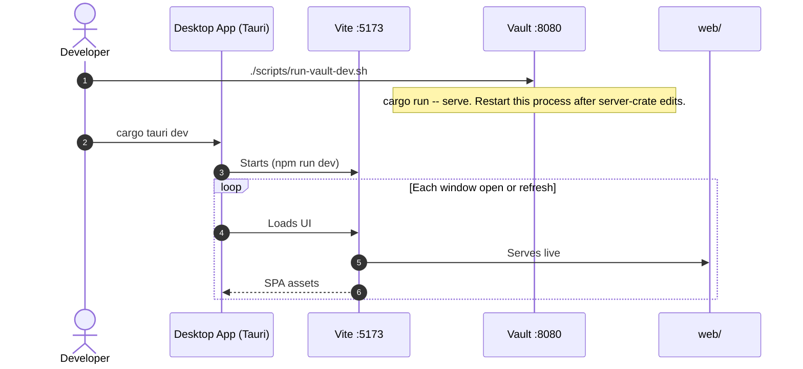
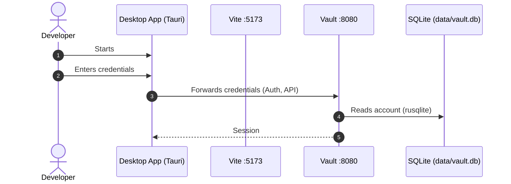
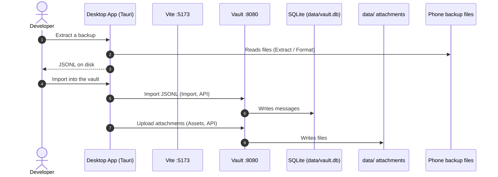
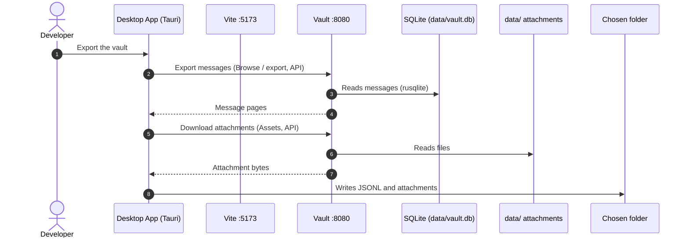

Message Vault is two processes: the **vault** (HTTP API and SQLite) and the **UI** that talks to it. This page is the map for someone who already compiles. Setup, tests, and pull requests stay on [Contributing](/vault/developer/contributing/). How messages move in and out is on [Message Transfer](/vault/developer/message-transfer/).

Related contracts: [HTTP API](/vault/developer/reference/api/), [Database](/vault/developer/reference/database/), [Export structure](/vault/developer/reference/export-structure/), and [Common message](/vault/developer/architecture/common-message/).

## Directory map

These are the folders in the repository. [Contributing](/vault/developer/contributing/) says which ones a first change should use.

```text title="Repository layout"
message-vault
├── config/                 # copy example → config.toml to run the vault locally
├── crates/                 # Rust crates Cargo builds together (src-tauri is not in this set)
│   ├── core/               # shared import/export job settings used by the desktop app
│   ├── exporters/          # parse iMessage, WhatsApp, SMS, and other backups into JSONL
│   ├── libs/               # shared code the exporters and the vault use (format, contacts,
│   │                       #   media, vault-push, vault-pull)
│   └── vault/              # message-vault-server (API + SQLite) and demo-seed (sample inbox)
├── docker/                 # image and Compose file that look like a published vault
├── docs/                   # bitrealm.io (User Guide, Developer docs, landing page)
├── schema/                 # SQLite CREATE TABLE files the vault embeds
├── scripts/                # run-vault-dev, check-pr, build-static, schema sync
├── src-tauri/              # desktop window around web/ (Tauri; built separately from crates/)
├── tests/                  # tests that span more than one crate; fixtures are fake data, never personal backups
├── web/                    # website and desktop UI (same React app)
└── web-next/               # old Next.js browse UI — ignore
```

## Binaries

`cargo build --workspace` produces these commands. `src-tauri/` is the desktop window. It is not a workspace member. The same exporter libraries run inside that app.

Three binaries are built: `message-vault-server` from `crates/vault/server/`,
`demo-seed` from `crates/vault/demo-seed/`, and `imessage-reader` from
`crates/helpers/imessage-reader/`. The last is not a command line. It reads
Apple Messages for the desktop app as a separate process, because the library
that parses `chat.db` is GPL and the app is under the Fair Core License; the
app starts it and speaks JSON lines to it over pipes. Everything else is a
library the desktop app links directly — the exporters have no command line.
Why: [ADR 0001](https://github.com/bitrealm-io/message-vault/blob/main/docs/adr/0001-no-command-line-except-the-vault-server.md)
and its amendment.

| Library | Comes from | Job |
|--------|------------|-----|
| `imessage-ir-exporter`, `sms-backup-restore-exporter`, `whatsapp-exporter` | `crates/exporters/` | Supported extract → JSONL |
| `go-sms-pro-exporter`, `imazing-exporter`, `openextract-exporter`, `sms-backup-plus-exporter` | `crates/exporters/` | Rescue / experimental extract |
| `message-reexport` | `crates/libs/reexport/` | Convert an existing export folder |
| `vault-push` / `vault-pull` | `crates/libs/` | JSONL → running vault / vault → JSONL |

C4 PlantUML sources and SVG exports live in [`docs/src/assets/architecture/`](https://github.com/bitrealm-io/message-vault/tree/main/docs/src/assets/architecture). Edit the `.puml` file, export SVG into the same folder, and commit both in one change.

## System context

A person uses the UI to import and view messages. The UI stores and retrieves them through the vault backend.


## Containers

Inside Message Vault the webpage and desktop app share `web/`. Both call the Rust API. The API reads and writes SQLite and attachment files.


## Deployment (from source)

On a developer workstation the vault process listens on `127.0.0.1:8080`. `cargo tauri dev` starts a native window and Vite on `:5173`. A browser can also load the UI from the vault.


## Session sequences

Host processes:

- **Desktop App (Tauri)** — native desktop window started by `cargo tauri dev`
- **Vite :5173** — dev server that serves live `web/` source
- **Vault :8080** — `message-vault-server` started by `./scripts/run-vault-dev.sh`

### Start the vault

Run the vault with `./scripts/run-vault-dev.sh`.



### Log in

**Prerequisite**

- Vault is running on `:8080`.
- Desktop App is running.
  - Vite is serving the WebView on `:5173`.

The developer types credentials in the SPA. Login is an Auth API call to the vault, not a login to Tauri.



### Import a backup

**Prerequisite**

- Vault is running on `:8080`
- Desktop App is running.
  - Vite is serving webview on `:5173`.
- User is logged in.

Messages and attachments are uploaded to the vault using the `vault-push` library.



### Export from the vault

**Prerequisite**

- Vault is running on `:8080`
- Desktop App is running.
  - Vite is serving webview on `:5173`.
- User is logged in.

Messages and attachments are downloaded from the vault using the `vault-pull` library.


